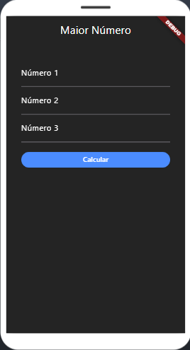

# Projeto para AP1

Este é um projeto em Flutter para a prova de Programação Para Aplicativos Móveis.

O projeto consiste em um aplicativo que pergunta 3 números e responde qual é o maior deles.

## License

The codes are released under the MIT License.
