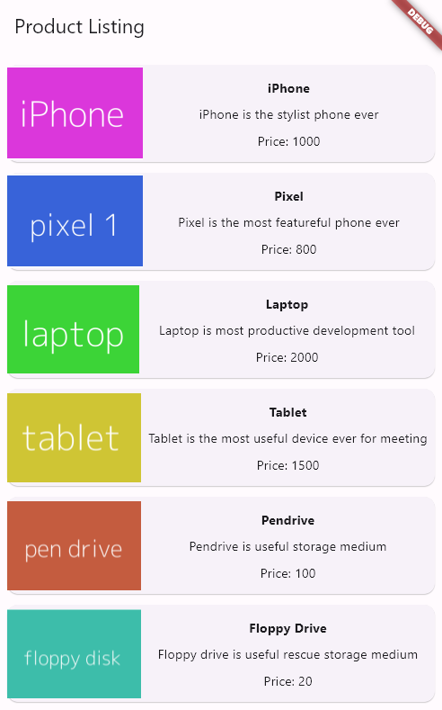

# Advanced Layout Application
<!-- This is a Flutter project for the Mobile Applications Programming exam.

The project consists of an application that asks for 3 numbers and responds with which one is the largest. -->

## License

The code is released under the MIT License.
